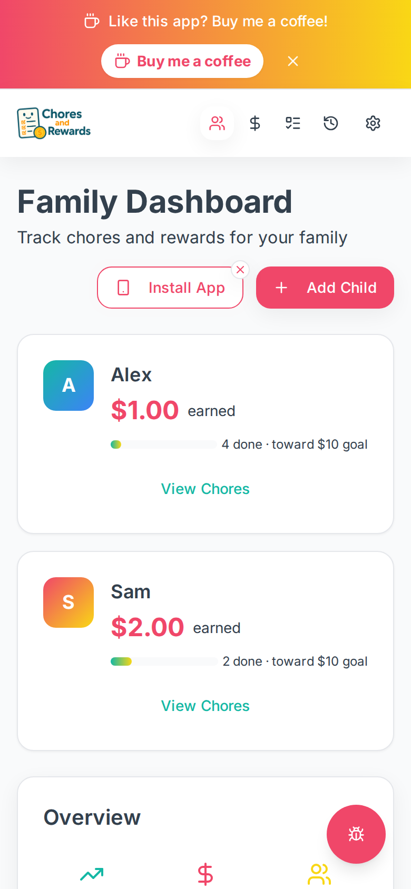
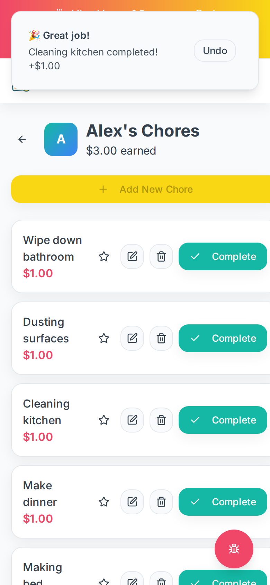
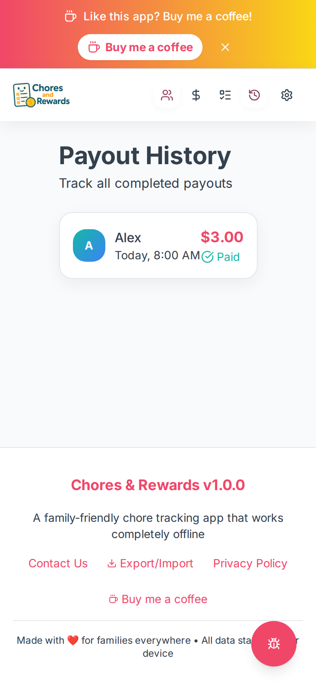

# Chores and Rewards

[](https://github.com/rodlunt/choresandrewardsV2/actions/workflows/ci.yml)
[](LICENSE)

A family chore tracking and rewards app. Kids get a list of chores, ticking one off adds its
value to their running total, and a payout resets that total to zero. Everything runs client-side
against the browser's IndexedDB: there is no database and no server-side persistence.

## What it is

- **Chores**: a title and a cent value, managed globally.
- **Children**: a name and a running cent total, plus a per-child list of favourite chores
  (`Child.favoriteChoreIds`, not a property on the chore itself).
- **Completions**: every ticked chore is recorded individually, so completion counts are real
  and a completion can be undone from its toast (refused if a payout already spent it).
- **Payouts**: recorded against a child, each one zeroes that child's total.
- **Parent PIN** (optional): payouts, chore edits and deletes, child deletes and imports can
  be gated behind a PIN set in Settings; with no PIN set, nothing is gated.
- **Backups**: JSON export, schema-validated import with a confirmation naming what it will
  replace and an automatic backup download first; a gentle reminder nudges periodic exports.
- **Bug reports**: an in-app button posts to `/api/issues`, which files the report as an
  issue on a private intake repository, screenshots included, so user data never lands in
  this public repo (see [`GITHUB_TOKEN_SETUP.md`](GITHUB_TOKEN_SETUP.md) and
  [`docs/security/`](docs/security/)). Without a configured token the rest of the app works;
  submitting reports returns an error.
- **Installable PWA**: offline-capable, with an install button on the dashboard.

## Stack

| Layer | Technology |
|---|---|
| Frontend | React 19, TypeScript, Vite, Tailwind CSS, Radix UI, wouter |
| Backend | Express 5 on Node.js, serving the built SPA plus the `/api/issues` route |
| Storage | Client-side only, IndexedDB via `idb`. No database, no server-side persistence |
| Package manager | pnpm (workspace-pinned, see `packageManager` in `package.json`) |
| Deployment | Docker Compose on a home server; CI gates on GitHub, deploys pulled by the server itself (see [`deploy/README.md`](deploy/README.md)) |

## Development setup

Requires [pnpm](https://pnpm.io/) (never npm, see `packageManager` in `package.json` for the
pinned version) and Node.js 22, matching CI.

```bash
pnpm install
cp .env.example .env   # then fill in GITHUB_TOKEN if you want bug reports to work locally
pnpm run dev            # starts the dev server (Vite + Express) on PORT, default 5000
```

See [`.env.example`](.env.example) for every environment variable the app reads, and
[`GITHUB_TOKEN_SETUP.md`](GITHUB_TOKEN_SETUP.md) for how to generate and scope the GitHub
token the bug report feature needs.

## Tests / checks

These are the exact commands CI runs in `.github/workflows/ci.yml`. Run them all locally
before pushing:

```bash
pnpm install --frozen-lockfile
pnpm run check                     # TypeScript type check (tsc)
pnpm run build                     # production build (vite build + esbuild)
pnpm audit --audit-level=high      # dependency security audit, its own CI job
pnpm run test                      # Vitest unit suite (storage, schemas, PIN, PWA capture)
pnpm run test:e2e                  # Playwright journeys against the dev server (Chromium)
```

CI also greps the client for common React hook misuse and validates the build output. All
three jobs (Run Pre-Deployment Checks, Security audit, Tests) are required status checks on
`main`.

## Deploy pipeline

`.github/workflows/ci.yml` runs the three gate jobs on every push to `main` and every pull
request. CI does not deploy: the server polls `origin/main` every five minutes, verifies that
exact commit's required checks concluded green via the public checks API, then pulls, rebuilds
and restarts, verifying the checkout sha, the container healthcheck and the live URL, with a
dead-man heartbeat watching the poller itself. Merged PRs reach production within about five
minutes. Detail in [`.github/DEPLOYMENT.md`](.github/DEPLOYMENT.md) and
[`deploy/README.md`](deploy/README.md).

## Docs

| Doc | What it covers |
|---|---|
| [`.github/DEPLOYMENT.md`](.github/DEPLOYMENT.md) | Hosting, CI/CD pipeline detail, manual deploy and rollback commands |
| [`GITHUB_TOKEN_SETUP.md`](GITHUB_TOKEN_SETUP.md) | Scoping and installing the GitHub token the bug report feature needs |
| [`CONTRIBUTING.md`](CONTRIBUTING.md) | Dev setup, local CI gates, PR expectations |
| [`SECURITY.md`](SECURITY.md) | How to report a vulnerability |
| [`deploy/README.md`](deploy/README.md) | The poll-based deployer: behaviour, failure modes, install |
| [`docs/security/threat-model-issues-endpoint.md`](docs/security/threat-model-issues-endpoint.md) | Threat model for the bug-report endpoint |
| [`docs/security/bug-report-access-policy.md`](docs/security/bug-report-access-policy.md) | Who may submit reports and what happens to them |
| [`docs/security/alerting-setup.md`](docs/security/alerting-setup.md) | Fault reporting and abuse alerting, operator runbook |
| [`VALIDATION.md`](VALIDATION.md) | Manual pre-deploy validation guide (predates the pnpm migration; commands there are npm-era) |
| [`BUG_REPORT.md`](BUG_REPORT.md) | A point-in-time bug audit from 2025-10-19; historical, not a live issue list |
| [`TODO.md`](TODO.md) | Outstanding low-priority items |

## Screenshots

| Dashboard | A child's chores | Payout history |
|---|---|---|
|  |  |  |

Captured from the real app at a phone viewport with seeded example data.

## Licence

MIT, see [`LICENSE`](LICENSE).
